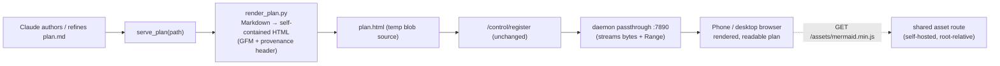

# Plan Viewer — render Markdown plans to a phone-readable web page

> A `serve_plan` companion to `serve_image`: point it at a `.md` plan / spec /
> research doc and get a Tailscale URL that renders it as a clean, mobile-friendly
> page — headings, tables, code, and **Mermaid diagrams** — so plans can be read
> and approved from a phone.

## Why

`serve-image` already gives us tokenized, TTL'd, Tailscale-reachable URLs. Images,
GIFs, and video all work because **browsers render them natively** — the daemon is a
dumb byte-passthrough. Markdown is the first content type a browser *won't* render
readably (it shows raw text). The gap is purely a **render step**: `.md → styled HTML`.

## Design

The blob is the finished artifact. So we render `.md → self-contained HTML` *before*
handing it to the existing daemon, which then serves it exactly like any other blob.
**No `register()` change, no `kind` field, no rename.**

### Components

| Piece | File | Change |
|-------|------|--------|
| Renderer | `scripts/render_plan.py` | **new** — `md → HTML`, mistune w/ built-in fallback |
| Shared Mermaid asset | `scripts/server.py` | **+1 route** `GET /assets/mermaid.min.js` (lazy-download, cached) |
| `serve_plan` tool | `scripts/mcp_server.py` | **new tool** — render then register, returns URL |
| `serve-plan` skill | `~/.claude/skills/serve-plan/` | **new** — thin wrapper, mirrors `serve-image` |
| `show-me` routing | `~/.claude/skills/show-me/` | `.md` input → `serve-plan` |

### Key decisions

- **Mermaid is client-side**, from a **shared `/assets/mermaid.min.js`** route
  (root-relative `<script src="/assets/...">` — no daemon IP baked into the page, blobs
  stay tiny). The 3.3 MB bundle is lazy-downloaded once into `~/.cache/serve-image/assets/`
  and self-hosted over Tailscale, so it works offline and leaks nothing externally.
- **Frozen snapshot**, matching the blob model. "Claude updates the visualization" =
  re-render + re-register. Not a live feed.
- **Bound to source = a provenance header** (`Rendered from <path> · <time>`), a label,
  not a dual-document subsystem.
- **Renderer fidelity:** `mistune` (GFM: tables, strikethrough, task lists) when
  importable; a built-in minimal converter otherwise, so it never hard-fails.

## Deferred (v2)

- Tailscale-only bind hardening (bind to TS IP, or `tailscale serve` for HTTPS).
- Multi-file / whole-directory plans with navigation.
- A curated high-level view that expands into full detail.

## Verification

1. Render this very file through `serve_plan` and open the URL on the phone.
2. Confirm the Mermaid diagram above draws, tables/code render, dark mode works.
3. Confirm it shows up in `list_served` and expires per TTL.
